[github](https://github.com/yo5on)  · 
[linkedin](https://www.linkedin.com/in/yo5on)  · 
[email](mailto:yo5on2025@gmail.com)

> **CSE student specializing in AI/ML at Christ University, Bangalore.** 
> **Building with AI, robotics, and embedded systems.** 
> *Small, sharp tools over big, vague ideas.*

<samp>c   c++   java   python   html   css   esp32   arduino   git/github   vs code</samp>

**[Robotic Arm](https://github.com/yo5on/Robotic-arm)**  ·  <samp>robotics, esp32</samp> 
ESP32-based robotic arm project focused on embedded control and multi-axis movement.

**[Line Follower](https://github.com/yo5on/line-follower)**  ·  <samp>esp32, c++, pid</samp> 
Line-following robot using sensor-based tracking, motor control, and PID tuning.

**[Gesture Controlled RC Car](https://github.com/yo5on/Gesture-control-rc-car)**  ·  <samp>esp32, robotics</samp> 
RC car controlled through hand gestures using embedded hardware and motion sensing.

**[Agentic AI Pest Monitoring](https://github.com/yo5on/Agentic-AI-Pest-Monitoring)**  ·  <samp>ai/ml, python, web</samp> 
Agentic AI-based pest monitoring framework focused on sustainable agricultural productivity and resource optimization.

**[Lab Work](https://github.com/yo5on/lab-work)**  ·  <samp>c, java, python, sql</samp> 
Collection of academic programming and laboratory work.

This profile is built around a collection of generated SVG graphics and custom 
tools designed to keep the page lightweight, consistent, and easy to maintain.

`ascii.svg` is generated from a photo using 
[`scripts/make_portrait.py`](scripts/make_portrait.py), which converts the image 
into a monochrome ASCII portrait. The contribution statistics and other profile 
graphics are generated automatically using 
[`scripts/generate_stats.py`](scripts/generate_stats.py) and GitHub's GraphQL API.

The stats are refreshed automatically through 
[GitHub Actions](.github/workflows/stats.yml), so contribution counts, streaks, 
language statistics, and the yearly activity map stay up to date without 
manually regenerating the graphics.

The SVG graphics use SMIL animations to create the reveal effect while keeping 
everything self-contained. No external image or statistics service is required, 
so the profile doesn't depend on third-party services to display its graphics.

The page uses JetBrains Mono to keep the typography consistent across the 
different SVG graphics. The font is embedded where necessary so the ASCII portrait 
maintains its intended character spacing across different viewers.
